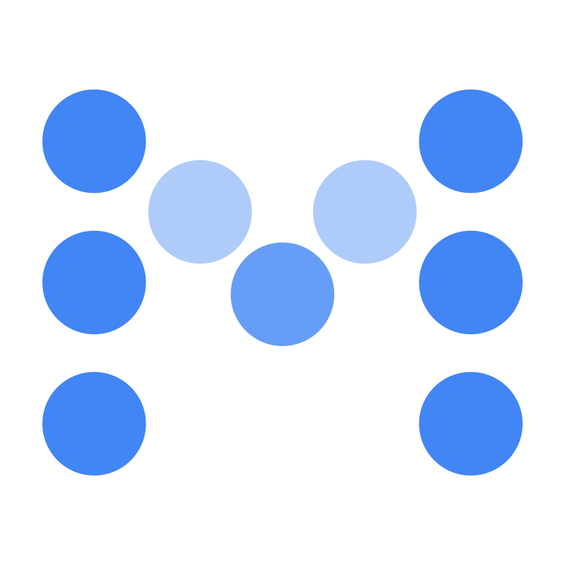
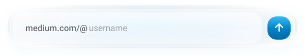

  

  

  <a href="https://github.com/Bhagirath00/Mediumapi"><picture><source media="(prefers-color-scheme: dark)" srcset="https://shieldcn.dev/github/license/Bhagirath00/Mediumapi.svg?variant=outline&amp;font=geist" /></picture></a>
  <a href="https://github.com/Bhagirath00/Mediumapi"><picture><source media="(prefers-color-scheme: dark)" srcset="https://shieldcn.dev/github/stars/Bhagirath00/Mediumapi.svg?variant=outline&amp;mode=dark&amp;font=geist" /></picture></a>
  <a href="https://github.com/Bhagirath00/Mediumapi"><picture><source media="(prefers-color-scheme: dark)" srcset="https://shieldcn.dev/github/views/Bhagirath00/Mediumapi.svg?variant=outline&amp;mode=dark&amp;font=geist" /></picture></a>

Minimalist content aggregation and synchronization dashboard.

### API Endpoints
* **Sync**: `POST /api/sync` — Synchronize latest articles from a Medium username.
* **Posts**: `GET /api/posts` — Retrieve stored aggregation data.
* **Post Detail**: `GET /api/posts/[slug]` — Retrieve post details by slug.
* **Stats**: `GET /api/stats` — Retrieve sync stats and post count.

### Setup
1. Configure environment keys in `.env`.
2. Run `npm install` to setup dependencies.
3. Execute `npx prisma db push` for database initialization.
4. Launch the platform with `npm run dev`.
